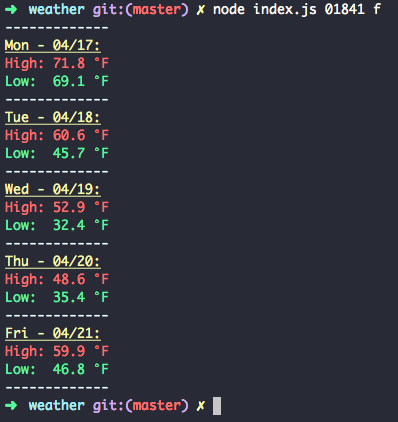

# weather-forecast-cli

uses open weather api to display high/low temperatures for next 5 days

its late and i wanted to know the temp to see if i should leave my aloe plant outside... so i made this...

